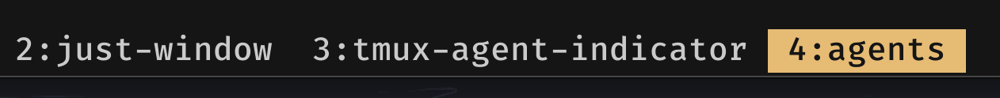
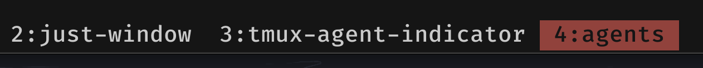

# tmux-agent-indicator

AI agents run in tmux panes but give no signal when they finish or need input. You have to keep switching panes to check. This plugin tracks agent state and surfaces it through pane borders, window titles, and status bar icons so you never miss a transition.

## Demo

https://github.com/user-attachments/assets/4fed0fc4-4d63-45e8-82c7-a1d3eedecc04

When the agent finishes, the window title background/foreground changes and the pane border updates to signal completion.

|  |  |
|:---:|:---:|
| needs-input: yellow window title | done: red window title |

## How it works

The plugin tracks three states per pane: `running`, `needs-input`, and `done`.

State transitions are driven by hooks. Claude Code fires hooks on prompt submit, permission request, and stop. Codex uses its `notify` command. Any other agent can call `agent-state.sh` directly from a wrapper script or hook.

Each state can change:
- Pane border color
- Pane background (supported but disabled by default to avoid visual noise)
- Window title background and foreground
- Status bar icon (per-agent, e.g. `claude=🤖`, `codex=🧠`)

States reset when you focus the pane/window, or on the next transition.

## Features

- Per-agent status icons in the status bar
- Knight Rider animation during `running` state
- Deferred pane reset: keep pane colors until focus, not when the hook fires
- Process detection fallback for agents that don't fire hooks

## Requirements

tmux 3.0+, bash 4+

## Installation

### One-command installer (recommended)

```bash
curl -fsSL https://raw.githubusercontent.com/accessd/tmux-agent-indicator/main/install.sh | bash
```

The installer will offer to run the interactive color setup wizard. You can also run it later:

```bash
bash ~/.tmux/plugins/tmux-agent-indicator/setup.sh
```

This installs files to `~/.tmux/plugins/tmux-agent-indicator` and updates:
- `~/.claude/settings.json` hooks for Claude (`UserPromptSubmit`, `PermissionRequest`, `Stop`)
- `~/.codex/config.toml` `notify` command for Codex

Integration uninstall options:

```bash
./install.sh --uninstall-claude
./install.sh --uninstall-codex
```

### TPM

Add to ~/.tmux.conf:

```tmux
set -g @plugin 'accessd/tmux-agent-indicator'
```

Reload tmux:

```bash
tmux source-file ~/.tmux.conf
```

## Status Bar Integration

For native status:

```tmux
set -g status-right '#{agent_indicator} | %H:%M'
```

For [minimal-tmux-status](https://github.com/niksingh710/minimal-tmux-status):

```tmux
set -g @minimal-tmux-status-right '#{agent_indicator} #(gitmux "#{pane_current_path}")'
```

## Configuration

Quick start with the most useful options:

```tmux
# Enable/disable visual channels
set -g @agent-indicator-border-enabled 'on'
set -g @agent-indicator-indicator-enabled 'on'

# Per-agent icons
set -g @agent-indicator-icons 'claude=🤖,codex=🧠,default=🤖'

# Keep pane colors until you focus the pane (instead of clearing immediately)
set -g @agent-indicator-reset-on-focus 'on'

# Knight Rider animation while running
set -g @agent-indicator-animation-enabled 'on'
```

<details>
<summary>Full configuration reference</summary>

```tmux
# Global toggles
set -g @agent-indicator-background-enabled 'on'
set -g @agent-indicator-border-enabled 'on'
set -g @agent-indicator-indicator-enabled 'on'

# Running state (default keeps pane/border unchanged)
set -g @agent-indicator-running-enabled 'on'
set -g @agent-indicator-running-bg 'default'
set -g @agent-indicator-running-border 'default'
set -g @agent-indicator-running-window-title-bg ''
set -g @agent-indicator-running-window-title-fg ''

# Needs-input state
set -g @agent-indicator-needs-input-enabled 'on'
set -g @agent-indicator-needs-input-bg 'default'
set -g @agent-indicator-needs-input-border 'yellow'
set -g @agent-indicator-needs-input-window-title-bg 'yellow'
set -g @agent-indicator-needs-input-window-title-fg 'black'

# Done state
set -g @agent-indicator-done-enabled 'on'
set -g @agent-indicator-done-bg 'default'
set -g @agent-indicator-done-border 'green'
set -g @agent-indicator-done-window-title-bg 'red'
set -g @agent-indicator-done-window-title-fg 'black'

# Per-agent icons
set -g @agent-indicator-icons 'claude=🤖,codex=🧠,default=🤖'

# Process fallback detection
set -g @agent-indicator-processes 'claude,codex,aider,cursor,opencode'

# Keep pane colors until pane focus-in after done
set -g @agent-indicator-reset-on-focus 'on'

# Running animation in status indicator
set -g @agent-indicator-animation-enabled 'off'
set -g @agent-indicator-animation-speed '300'
```

Pane background coloring is unchanged by default (`*-bg 'default'` for all states).
To enable background colors, set per-state values in your `~/.tmux.conf`, for example:

```tmux
set -g @agent-indicator-needs-input-bg 'colour94'
set -g @agent-indicator-done-bg 'green'
```

Empty option values are treated as "do not apply this property" (for toggles, empty behaves as disabled). Example:

```tmux
set -g @agent-indicator-done-bg ''
```

This skips done-state background changes while still allowing done border/title styles.

Note: tmux border coloring is window-scoped (`pane-active-border-style` / `pane-border-style`).
You can style the active border differently, but tmux cannot set a fully independent border color for one arbitrary non-active pane.

</details>

<details>
<summary>Color presets</summary>

Preset 1 (Balanced):

```tmux
set -g @agent-indicator-running-bg ''
set -g @agent-indicator-running-border ''
set -g @agent-indicator-needs-input-bg 'colour223'
set -g @agent-indicator-needs-input-border 'colour214'
set -g @agent-indicator-done-bg ''
set -g @agent-indicator-done-border 'colour34'
set -g @agent-indicator-done-window-title-bg 'colour34'
set -g @agent-indicator-done-window-title-fg 'black'
```

Preset 2 (High Contrast):

```tmux
set -g @agent-indicator-running-bg 'colour52'
set -g @agent-indicator-running-border 'colour196'
set -g @agent-indicator-needs-input-bg 'colour94'
set -g @agent-indicator-needs-input-border 'colour226'
set -g @agent-indicator-done-bg ''
set -g @agent-indicator-done-border 'colour46'
set -g @agent-indicator-done-window-title-bg 'colour46'
set -g @agent-indicator-done-window-title-fg 'black'
```

Preset 3 (Subtle):

```tmux
set -g @agent-indicator-running-bg ''
set -g @agent-indicator-running-border 'colour244'
set -g @agent-indicator-needs-input-bg ''
set -g @agent-indicator-needs-input-border 'colour220'
set -g @agent-indicator-done-bg ''
set -g @agent-indicator-done-border 'colour70'
set -g @agent-indicator-done-window-title-bg 'colour238'
set -g @agent-indicator-done-window-title-fg 'colour194'
```

</details>

<details>
<summary>Tmux color reference</summary>

Tmux supports:
- 8 basic colors: `black`, `red`, `green`, `yellow`, `blue`, `magenta`, `cyan`, `white`
- Bright variants (`brightred`, `brightblue`, etc.)
- 256-color palette: `colour0` ... `colour255`


</details>

## Custom Agent Integration

To integrate any agent that does not have built-in hook support, call `agent-state.sh` from your agent's hooks or wrapper script.

```bash
~/.tmux/plugins/tmux-agent-indicator/scripts/agent-state.sh --agent claude --state running
~/.tmux/plugins/tmux-agent-indicator/scripts/agent-state.sh --agent claude --state needs-input
~/.tmux/plugins/tmux-agent-indicator/scripts/agent-state.sh --agent claude --state done
~/.tmux/plugins/tmux-agent-indicator/scripts/agent-state.sh --agent claude --state off
```

`--state off` always resets pane background and border immediately.

## Claude Hook Template

Default template file: `hooks/claude-hooks.json`
It maps:
- `UserPromptSubmit` -> `running`
- `PermissionRequest` -> `needs-input`
- `Stop` -> `done`

## License

MIT
